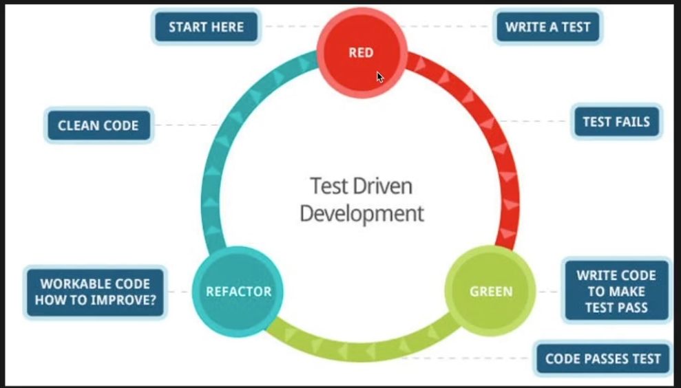

## TDD (Test driven development)

- Test code를 작성하고, 개발을 시작하는 방법론
- 실제 현업에서 Test code를 작성하기 어려운 상황인 경우 개발하기 도와주는 책 (Working Effectively with Legacy Code)
  - 중요한 기능들만 Testcode 코드를 작성하는 것과 같이 유연하게 하는 것도 좋음.

### Red-Green-Refactor

- - RED: Test code는 작성하였지만, 구현되지 않은 상태이기 때문에 에러가 나는 상태를 의미
  - GREEN: 구현을 한 상태
  - REFACTOR: Green 상태에서 코드의 개선을 할 필요가 있다면 Refactor 과정을 거치는 것. 해당 상태에서 수정하였을 때, RED 상태로 갈 수도 있고 GREEN 상태로 갈 수도 있도 있음. 그래서 Refactoring을 한 다음에는 무조건 Test code를 돌려보아야 함.
- 방법
  - Fake it
    단순히 테스트 코드만 통과하도록 개발하는 방법
  - Obvious implementation
    실제 구현을 할 때, 구현하는 방법

### AAA (Arrange, Act, Assert)

- 테스트 코드의 구성 순서를 정형화함으로 코드 이해하기 쉽게 만드는 패턴
- Arrange: 테스트에 필요한 것들을 세팅
- Act: 세팅된 값을 기반으로 테스트
- Assert: 결과 값이 예상하는 값과 같은지 확인
