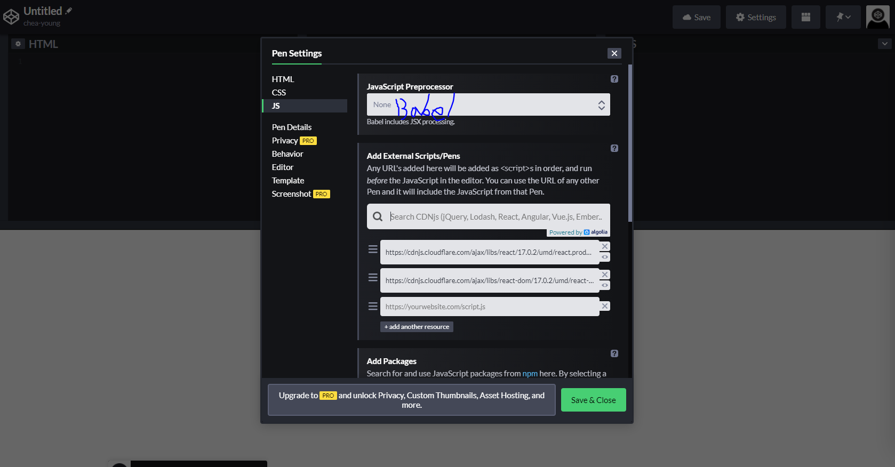

# study_React
코드잇의 React 부분을 공부하면서 정리하는 Repository

## 목차
- React 시작하기
- React란?
- 코드펜
- JSX

### Start
0. 다운
- npm 다운
- yarn 다운
    - https://classic.yarnpkg.com/en/docs/install#windows-stable
1. 설정
 ```
npx create-react-app <프로젝트명>
cd <프로젝트명>
```
2. 서버 띄우기
```
yarn start
```
3. 
    

### React란?
- UI를 효과적으로 구축하기 위해 사용하는 자바스크립트 기반의 라이브러리.
- MIT 라이센스를 이용한다는 점에서 자유롭게 사용이 가능.
- 단순히 웹 환경에서 돌릴 수 있다는 점에서 굳이 로컬 컴퓨터에 개발 환겨을 구축하지 않아도 온라인 상에서 소스코드를 테스트 하는 것이 가능. [https://codepen.io/pen/]
- 특징은?
    - 선언적이다: 대화형 UI를 작성하기가 유리하다. 데이터가 변경되었을 때 효율적으로 렌더링을 수행할 수 있도록 함.
    - 컴포넌트 기반이다.: 캡슐화된 컨포넌트가 상태를 관리하고 UI를 효과적으로 구성할 수 있음.
- 장단점은?
    - 클라이언트 렌더링(웹 사이트에서 그때 그때 데이터를 받아오는 방식) 뿐만 아니라 서버 사이드 렌더링(필요한 데이터를 미리 받아 놓은 방식)도 지원함. 그래서 Ajax 등과 같은 비동기 방식과 비교했을 때 검색 엔진 최적화 등에 있어서 유리한 형태로 스스코드 작성하는 것이 가능.
        - 왜냐하면 자바스크립트를 검색엔진이 지원하지 않는 경우도 있기 때문에 서버 사이드 렌더링의 형태도 대비를 해놓아하는데 리액트는 서버 사이드 렌더링 또한 지원.

### 코드펜 [https://codepen.io/trending]
- 프로트 엔드 개발에 있어서 유용한 사이트
- 로컬 컴퓨터에 개발 환경을 구축하지 않아도 빠르고 효과적으로 웹 사이트 상에서 소스코드를 작성하여 테스트 가능.
- React를 작성해보기 위해 다음과 같이 설정이 필요

    
    
    - JavaScript Preprocessor: Babel
    - Add External Scripts/Pens: react, react-Dom

### JSX!?
- 자바스크립트 문법의 확장판
- 리액트에서의 Element를 제공
- Component는 항상 렌더링을 수행하기 때문에 render() 함수로 이를 구현
- 자바스크립트와 HTML을 한 번에 합쳐 놓은 것과 같은 문법
- JS에서 render()안에 들어가는 <h1>와 같은 것 들이 JSX를 이용해서 작성한 것

#### 주의사항
- 원하는 대로 뜨지 않을 때 console 창 확인해 보기

#### 참고사이트
- goorm.edu의 'React와 Node.js를 활용한 고객 관리 시스템 개발' 강의